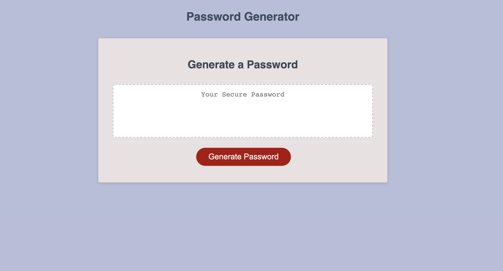

#  Password Generator

This assignment requires to create an application that an employee can use to generate a random password based on criteria they’ve selected by modifying starter code. This application will run in the browser, and will feature dynamically updated HTML and CSS powered by JavaScript code that I write. It will have a clean and polished user interface that is responsive, ensuring that it adapts to multiple screen sizes.

The application has a simple, responsive interface with a single button for the user to click to generate a password. Upon clicking the button, a prompt box will ask the user to enter the desired password length (between 8 and 128 characters) followed by a series of confirm boxes to choose the character types to include (options are Lowecase, Uppercase, Numbers and Special Characters). Once the user has chosen the desired criteria, the application will validate the input.

Once valid input has been entered, the application will generate a random password that includes all the character types chosen by the user. The generated password will be displayed in the text box on the page.

* This application user experience is intuitive and easy to navigate.

* This application user interface style is clean and polished.

* Application deployed at live URL.

https://kajalpatel20.github.io/Password-Generator/

* GitHub repository that contains application code.

https://github.com/kajalpatel20/Password-Generator

